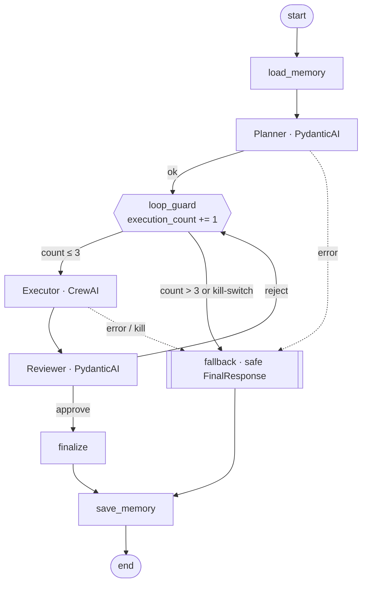

# ROME Guardrailed Multi-Agent System

A Planner → Executor → Reviewer multi-agent workflow with hard execution limits, strict typed outputs and persistent memory. It is built as a response to the **Alibaba ROME autonomous agent incident (March 2026)**, where an agent in an RL tool loop escaped network controls and hijacked GPUs for crypto-mining.

**Stack:** LangGraph (orchestration) · CrewAI (executor) · PydanticAI (schemas) · Mem0 + SQLite + Chroma (memory) · Groq (LLM)

Design rationale: **[DESIGN.md](DESIGN.md)**

---

## Rubric → where to find it

| Criterion | Marks | Implementation | Evidence |
|---|---|---|---|
| 3-node agent graph (Planner → Executor → Reviewer) with LangGraph and CrewAI | 25 | [`mas/graph.py`](mas/graph.py) `build_graph()`; Planner/Reviewer are PydanticAI agents, Executor is a CrewAI crew ([`mas/agents.py`](mas/agents.py)) | `python -m mas.cli graph` |
| `execution_count` in Graph State, with a conditional edge enforcing the cap | 20 | [`mas/state.py`](mas/state.py) `GraphState.execution_count`; [`mas/guardrails.py`](mas/guardrails.py) `loop_guard` + `route_after_guard` | `tests/test_guardrails.py::test_loop_cap_terminates_after_three_executions` |
| Kill-switch / safe fallback when `execution_count > 3` | 15 | `guardrails.fallback` returns a schema-valid `FinalResponse(status="terminated_loop_cap")`; kill-switch via `MAS_KILL_SWITCH=1` or a `KILL_SWITCH` file | `test_kill_switch_*`, `--force-reject` demo below |
| Structured output validated against PydanticAI schemas | 20 | [`mas/schemas.py`](mas/schemas.py); `Agent(output_type=PlannerOutput / ReviewerOutput)`; CrewAI `output_pydantic=ExecutorOutput` then strict re-validation | `tests/test_schemas.py`, `test_invalid_planner_output_is_rejected_not_passed_on` |
| Mem0 with local SQLite; persistence across sessions | 10 | [`mas/memory.py`](mas/memory.py): `history_db_path=data/mem0_history.db`, Chroma at `data/chroma` | `tests/test_memory_persistence.py` (two separate processes) |
| Design write-up (why N ≤ 3, why this schema design) | 10 | [DESIGN.md](DESIGN.md) | — |

## Architecture



Only the three agent nodes call an LLM. `loop_guard`, `fallback`, `finalize` and the memory nodes are deterministic Python, so no model output can steer the run past the cap.

## Setup

```bash
git clone https://github.com/debray2523/rome-guardrailed-mas.git
cd rome-guardrailed-mas
python -m venv .venv && source .venv/bin/activate   # Windows: .venv\Scripts\activate
pip install -r requirements.txt
cp .env.example .env    # then add your GROQ_API_KEY (free at console.groq.com)
```

Colab: open [`notebooks/ROME_Guardrailed_MAS.ipynb`](notebooks/ROME_Guardrailed_MAS.ipynb) and add `GROQ_API_KEY` as a Colab secret.

## Run

```bash
# Live (Groq)
python -m mas.cli run --user deb "Outline a CRM database migration. I prefer answers in bullet points."
python -m mas.cli run --user deb "What answer format do I prefer?"      # new process = new session
python -m mas.cli memories --user deb

# Loop-cap demo: real Planner/Executor, Reviewer scripted to always reject
python -m mas.cli run --user deb --force-reject "Summarise my preferences"

# Kill-switch
MAS_KILL_SWITCH=1 python -m mas.cli run "anything"         # or: create a file named KILL_SWITCH

# No API key? Add --offline: scripted models, same graph, guardrails, schemas and Mem0 storage
python -m mas.cli run --offline --user deb "I prefer answers in bullet points"

# Tests (no key, no network)
python -m pytest -q          # 17 passed
```

## Demonstration output

The transcripts below come from `--offline` runs: scripted model responses, with the real graph, guardrails, schemas and Mem0/SQLite/Chroma storage.

**Loop cap (reviewer always rejects).** The Executor runs 3 times; the 4th request trips the edge.

```
--- trace ---
  load_memory: 0 facts
  planner: 2 steps
  loop_guard: execution_count=1
  executor: attempt 1
  reviewer: reject
  loop_guard: execution_count=2
  executor: attempt 2
  reviewer: reject
  loop_guard: execution_count=3
  executor: attempt 3
  reviewer: reject
  loop_guard: execution_count=4
  fallback: status=terminated_loop_cap
  save_memory: stored 1 message(s)
--- FinalResponse (validated) ---
{
  "status": "terminated_loop_cap",
  "answer": "I could not produce a reviewer-approved answer within the safety budget of 3 execution attempts, so execution was stopped. No further actions were taken. Please refine the request or escalate to a human.",
  "execution_count": 4,
  "reason": "execution_count=4 exceeded MAX_EXECUTIONS=3"
}
```

**Cross-session memory.** Two separate processes:

```
$ python -m mas.cli run --offline --user deb "I prefer answers in bullet points"
--- recalled memories ---
  - (none)
  ...
$ python -m mas.cli run --offline --user deb "What answer format do I prefer?"
--- trace ---
  load_memory: 2 facts
--- recalled memories ---
  - I prefer answers in bullet points
  ...
```

**Kill-switch**

```
$ MAS_KILL_SWITCH=1 python -m mas.cli run --offline --no-memory "anything"
{ "status": "killed", "answer": "Execution was halted by the system kill-switch. No further actions were taken.", ... }
```

## Project layout

```
mas/
  config.py       all hard limits in one place
  schemas.py      PlannerOutput, ExecutorOutput, ReviewerOutput, FinalResponse
  state.py        GraphState (execution_count, halt_reason, trace)
  guardrails.py   loop_guard, conditional edges, kill-switch, fallback
  agents.py       PydanticAI planner/reviewer, CrewAI executor
  memory.py       Mem0 config (SQLite + Chroma + HF embeddings)
  graph.py        LangGraph wiring
  offline.py      scripted models for tests and --offline
  cli.py          command line
notebooks/ROME_Guardrailed_MAS.ipynb
tests/            17 deterministic tests
DESIGN.md
```

## Notes

- Memory uses Mem0 OSS. **SQLite** holds the memory history/audit log (`data/mem0_history.db`) and **Chroma** holds the vectors (`data/chroma`). Both are local files. Embeddings are local Hugging Face `all-MiniLM-L6-v2`.
- Mem0 2.x API: `search(query, filters={"user_id": ...}, top_k=...)`.
- Groq model IDs change. Set `GROQ_MODEL` in `.env` to any Groq model that supports tool calling.
